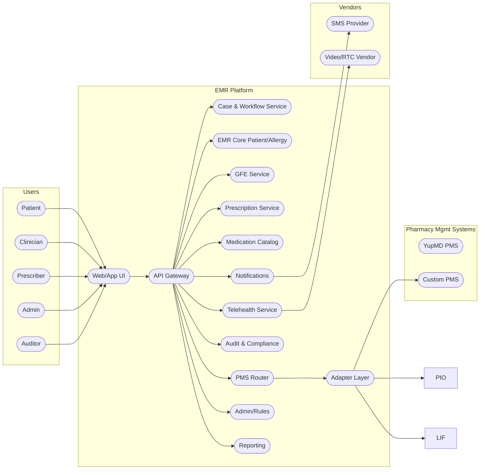
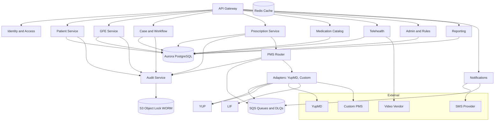
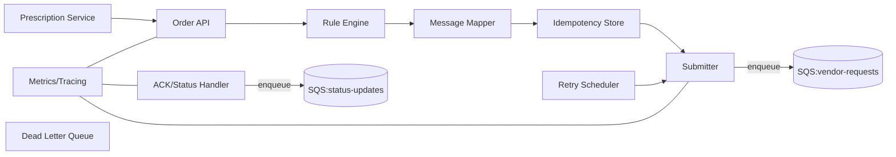
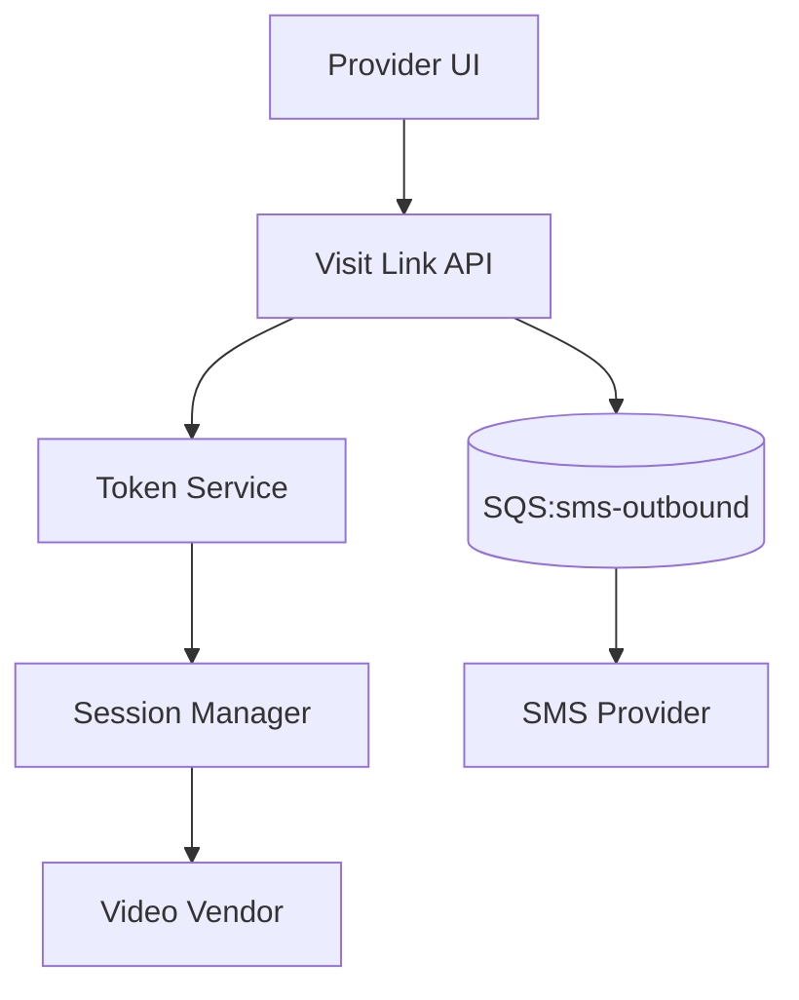
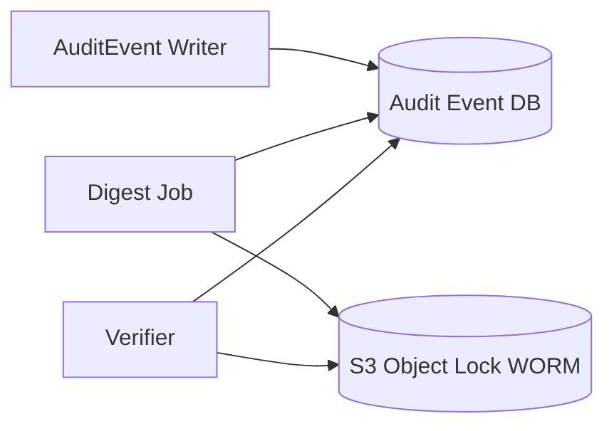
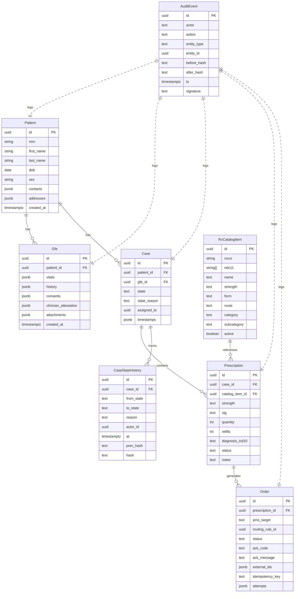
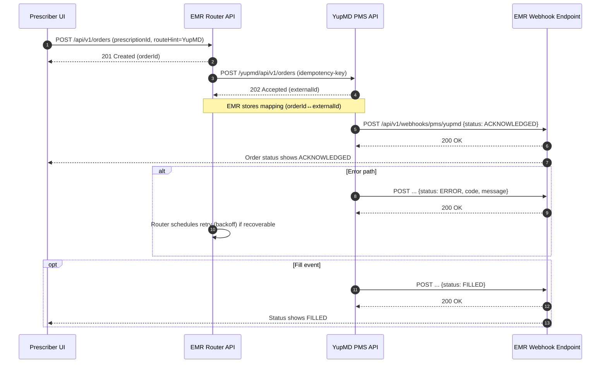
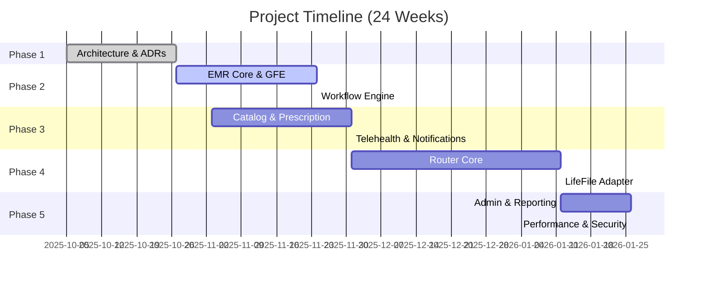

# Master Solution & Architecture Design Document — EMR + GFE → Prescription → PMS Routing Platform

---

## 1. Document Control

* **Owner:** Zigvy Corp
* **Version:** 1.0 (Proposal)
* **Date:** 2025-09-22

---

## 2. Executive Summary

This proposal outlines the architecture, scope, and delivery plan for building a HIPAA-compliant EMR subsystem that manages patients, Good Faith Exams (GFEs), prescriptions, and integrates with Pharmacy Management Systems (PMS). The document includes:

* Solution design (C4 diagrams, interfaces, data architecture)
* Security and compliance measures
* Estimation and delivery timeline
* Risk assessment and mitigation

**Client Value:** A secure, scalable, and regulatory-compliant platform that accelerates patient care, improves prescriber efficiency, and ensures reliable order routing to PMS partners.

---

## 3. Context & Stakeholders

* **Business Drivers:** Regulatory compliance, prescriber efficiency, patient access
* **Stakeholders:** Prescribers, Clinicians, Admins, Patients, Compliance auditors
* **Constraints:** HIPAA, DEA rules, state licensing
* **Assumptions:** BAAs signed with hosting & vendors, partner APIs accessible

---

## 4. Architecture Principles

* Domain-first bounded contexts
* Few, stable interfaces (REST/JSON, Async events)
* Backward compatibility; version contracts on breaking changes
* Observability & failure handling day 1

---

## 5. Requirements

### Functional

* Patient management
* GFE intake
* Case workflow engine
* Prescription approval/denial
* PMS routing & adapters: **YupMD (first-class internal PMS)**.
* Telehealth integration
* Immutable audit log
* Notifications (SMS/email)
* Admin tools (users, catalog, routing rules)
* Reporting

### Non-Functional

* **Performance:** p95 API read ≤ 350ms, write ≤ 500ms
* **Availability:** 99.9% uptime, RTO ≤ 2h, RPO ≤ 15min
* **Compliance:** HIPAA Security Rule, BAAs in place
* **Security:** Role-based access, TLS 1.2+, AES-256

---

## 6. Use Cases & Journeys

* UC-01: Clinician submits GFE
* UC-02: Prescriber reviews case, approves Rx
* UC-03: Patient joins telehealth via SMS link
* UC-04: System routes Rx to PMS, handles ACK/ERROR
* UC-05: Auditor exports immutable logs

---

## 7. Domain Model & Glossary

**Entities:** Patient, GFE, Case, Prescription, RxCatalogItem, Order, AuditEvent, RoutingRule, User

**Glossary:** MRN, RXCUI, NDC, ICD-10, PHI, AuditEvent, Consent, Encounter

---

## 8. Architecture Views (C4)

### 8.1 C1 — System Context



### 8.2 C2 — Container View



### 8.3 C3 — Component View

#### 8.3.1 PMS Router & Adapters



#### 8.3.2 Telehealth & One-time Links



#### 8.3.3 Audit Immutability



---

## 9. Interfaces & Contracts

### 9.1 API Conventions

* **Authentication:** OAuth2/OIDC Bearer JWT with fine-grained scopes (`patient:read`, `rx:write`, etc.).
* **Content Negotiation:** `application/json; charset=utf-8` for requests and responses.
* **Idempotency:** `Idempotency-Key` header required on POST/PUT endpoints that create or modify state.
* **Pagination:** `?page=<n>&pageSize=<m>` with `X-Total-Count` header in response.
* **Filtering & Sorting:** `?filter=field:eq:value` and `?sort=field:asc`.
* **Error Handling:** RFC 7807 Problem+JSON objects with standardized codes.
* **Rate Limiting:** Default 60 requests/minute/user; burst handling via 429 Too Many Requests.

### 9.2 REST Endpoints

* **Patients**

  * `POST /api/v1/patients` → create patient
  * `GET /api/v1/patients/{id}` → retrieve patient demographics
  * `PATCH /api/v1/patients/{id}` → update patient
* **Good Faith Exam (GFE)**

  * `POST /api/v1/patients/{id}/gfe` → submit GFE data
  * `GET /api/v1/gfe/{id}` → retrieve GFE
* **Cases**

  * `POST /api/v1/cases` → create case from GFE
  * `POST /api/v1/cases/{id}/transition` → change case state with reason
  * `GET /api/v1/cases/{id}/timeline` → view audit timeline
* **Telehealth**

  * `POST /api/v1/cases/{id}/visit-link` → generate one-time visit link
  * `POST /api/v1/cases/{id}/visit-notes` → attach visit notes
* **Medication Catalog**

  * `GET /api/v1/catalog` → list products (filters: category, subcategory, active)
  * `POST /api/v1/catalog` → add new product
* **Prescription**

  * `POST /api/v1/cases/{id}/prescriptions` → create prescription for case
  * `POST /api/v1/prescriptions/{id}/approve` → approve prescription
  * `POST /api/v1/prescriptions/{id}/deny` → deny prescription with reason
* **Orders**

  * `POST /api/v1/orders` → place order into Router. Body may include `routeHint` values like `"YupMD"`.
  * `GET /api/v1/orders/{id}/status` → fetch order status
  * `POST /api/v1/orders/{id}/retry` → retry failed order
* **Webhooks**

  * `POST /api/v1/webhooks/pms/yupmd` → receive ACK/ERROR/FILLED from **YupMD**
  * `POST /api/v1/webhooks/pms/{adapter}` → receive from other PMS (post‑MVP)
* **Admin**

  * `POST /api/v1/admin/users` → add user
  * `PATCH /api/v1/admin/users/{id}` → update user/role
  * `POST /api/v1/admin/routing-rules` → add routing rule (default target YupMD)
  * `GET /api/v1/admin/routing-rules` → list routing rules

### 9.3 Example Schemas Example Schemas

**Patient (POST request):**

```json
{
  "mrn": "12345",
  "first_name": "Jane",
  "last_name": "Doe",
  "dob": "1980-05-01",
  "sex": "F",
  "contacts": { "phone": "+1555123456" },
  "addresses": [ { "line1": "123 Main St", "city": "NYC" } ]
}
```

**Prescription (POST request):**

```json
{
  "catalog_item_id": "uuid-abc",
  "strength": "20mg",
  "sig": "Take 1 tablet daily",
  "quantity": 30,
  "refills": 2,
  "diagnosis_icd10": "I10"
}
```

### 9.4 Error Taxonomy

| Code           | HTTP | Meaning                         | Retry?            |
| -------------- | ---- | ------------------------------- | ----------------- |
| ERR_VALIDATION | 422  | Schema or business rule invalid | No                |
| ERR_FORBIDDEN  | 403  | No permission to access         | No                |
| ERR_CONFLICT   | 409  | Conflict (idempotency, state)   | No                |
| ERR_UPSTREAM   | 502  | PMS/vendor failed               | Yes (backoff)     |
| ERR_RATE_LIMIT | 429  | Exceeded allowed rate           | Yes (after delay) |

### 9.5 Security Contracts

* Endpoints tagged with required scopes in OpenAPI spec.
* Sensitive payload fields (PHI) logged only in masked form.
* Webhooks authenticated with HMAC signatures (shared secret per PMS adapter).

### 9.6 OpenAPI (excerpt) — YupMD Webhook

```yaml
openapi: 3.1.0
info:
  title: EMR PMS Webhooks
  version: 1.0.0
paths:
  /api/v1/webhooks/pms/yupmd:
    post:
      summary: YupMD status callback (ACK/ERROR/FILLED)
      operationId: webhookYupmdStatus
      security: []  # HMAC-only; no Bearer
      parameters:
        - in: header
          name: X-Signature
          required: true
          description: HMAC SHA-256 signature of the request body using shared secret
          schema: { type: string }
        - in: header
          name: X-Timestamp
          required: true
          description: Millisecond epoch to prevent replay; reject if skew > 5 min
          schema: { type: string }
      requestBody:
        required: true
        content:
          application/json:
            schema:
              type: object
              required: [externalId, localOrderId, status]
              properties:
                externalId: { type: string }
                localOrderId: { type: string, format: uuid }
                status: { type: string, enum: [ACKNOWLEDGED, ERROR, FILLED] }
                code: { type: string, description: Vendor/status code }
                message: { type: string, description: Human-readable context }
      responses:
        '200':
          description: Accepted and processed
        '400':
          description: Invalid payload/signature/timestamp
        '409':
          description: Duplicate or out-of-order event (idempotent no-op)
```

---

## 10. Data Architecture

### 10.1 ERD (Logical)



### 10.2 Data Classification & Controls

* PHI encryption at rest/in transit
* Role-restricted access by entity type
* PITR backups and long-term audit retention
* CDC pipeline to analytics warehouse

### 10.3 Indexing & Query Optimization

* Composite indexes on case_id, prescription_id for high-frequency queries.
* JSONB indexes on vitals, history, attempts fields.
* Query analyzer to identify slow queries and tune regularly.

### 10.4 Migration Strategy

* Versioned schema migrations via Flyway/Liquibase.
* Backward-compatible rollout: add columns before dropping.
* Pre-production dry runs and rollbacks tested.

### 10.5 Backup & Retention

* Automated nightly snapshots retained 30 days.
* Weekly full backups retained 1 year.
* AuditEvent retention: 7 years minimum for HIPAA compliance.

### 10.6 Data Lineage & Export

* FHIR-compliant export endpoints (Patient, Observation, MedicationRequest).
* ETL jobs to analytics warehouse for reporting.
* Audit export API for compliance officers.
* **YupMD synchronization**: periodic reconciliation job compares EMR Orders vs. YupMD Orders by `externalId` and status to ensure eventual consistency.

### 10.7 Encryption & Key Management Encryption & Key Management

* AWS KMS for all data volumes and S3 buckets.
* Automatic key rotation yearly.
* Field-level encryption for sensitive PHI (SSNs if applicable).

### 10.8 Change Data Capture (CDC)

* Logical replication to Kafka or Kinesis.
* Downstream consumers: reporting, monitoring, anomaly detection.
* Replay mechanism for missed events.

---

## 11. Integration Architecture

### 11.1 Adapter strategy (YupMD-first)

* **Primary (MVP): YupMD Adapter** — our internal PMS. Lowest latency path with tight contract control. Uses REST/JSON over TLS with HMAC signed webhooks.

### 11.2 Contracts by adapter

* **YupMD**

  * **Submit**: `POST /yupmd/api/v1/orders` (from Router→YupMD)

    * Payload: `{ orderId, prescription, patientRef, prescriberRef, pharmacyRef, notes }`
  * **Status callbacks**: YupMD → EMR via `POST /api/v1/webhooks/pms/yupmd`

    * Payload: `{ externalId, localOrderId, status: "ACKNOWLEDGED|ERROR|FILLED", code?, message? }`
  * **Auth**: mTLS (intra‑org) + HMAC signature header `X-Signature`.
  * **Idempotency**: `Idempotency-Key` honored; duplicate submits are no‑ops.

### 11.3 Routing rules

* Rules DSL unchanged; **default target = YupMD** unless a higher‑priority rule matches (e.g., geography, payer, product pilot to external PMS).
* Example: `when target == null then target = 'YupMD'`.

### 11.4 Retries & idempotency

* Exponential backoff, max attempts configurable (default 5), then DLQ.
* Idempotency keys stored at Router; adapters must be idempotent.

### 11.5 Observability

* Per‑adapter metrics: submit latency, ACK SLO, error rate, queue depth.
* Correlate by `orderId` and `externalId` across EMR↔YupMD.

### 11.6 YupMD Order Flow — Sequence Diagram



### 11.7 Integration Deep Dive & Gaps (YupMD)

**Authentication & transport**

* Intra‑org **mTLS** between Router↔YupMD; certificate rotation every 90 days.
* Webhook HMAC SHA‑256 over raw body; include `X-Timestamp` to prevent replay; reject if |now−timestamp| > 300s.

**Idempotency & ordering**

* `Idempotency-Key` required on submit; store hash of payload.
* Webhooks are **at‑least‑once**; dedupe on `(externalId,status,code)`; ignore out‑of‑order older events.

**Status mapping & retry matrix**

| YupMD status/code | EMR status   | Retry? | Notes                               |
| ----------------- | ------------ | -----: | ----------------------------------- |
| ACKNOWLEDGED      | Acknowledged |     No | Terminal for submit flow            |
| ERROR/5xx         | Error        |    Yes | Retry with backoff up to 5 attempts |
| ERROR/4xx         | Error        |     No | Surface to UI; manual fix & retry   |
| FILLED            | Filled       |     No | Terminal                            |

**Reconciliation**

* Nightly job pulls recent YupMD orders by `externalId` and compares to EMR; heals missing ACK/FILLED updates.
* Creates `AuditEvent` for any corrections.

**Throughput & SLOs**

* Target submit p95 ≤ 500ms; ACK propagation ≤ 60s.
* Max sustained: 10 orders/sec; burst 50 orders in 5s.

**Versioning & compatibility**

* `X-Contract-Version` header; breaking changes require new version and side‑by‑side support.

**Supportability**

* Admin tool: re‑sign and replay webhook sample for incident triage.
* DLQ replay tool with safe windowing and dry‑run.

**Security & compliance**

* Minimize PHI in order payload; use references where possible.
* Full audit of submit/request/response and webhook processing, with hash chain.

**Test plan (integration)**

* Happy path: submit→ACK→FILLED.
* Error: transient 5xx (retry), permanent 4xx (surface + manual retry).
* Idempotency: duplicate submit with same key → single order.
* Replay: duplicate webhook suppressed; out‑of‑order handled.
* Chaos: drop N% of webhooks; ensure reconciliation heals state.

---

## 12. Security & Compliance

* **Authentication:** OIDC with MFA for prescribers/admins.
* **Authorization:** Role-based access with least privilege.
* **Audit:** Immutable logs with chained hashes and external backups.
* **HIPAA:** All PHI encrypted at rest and in transit.
* **BAAs:** Executed with cloud and vendor partners; **internal YupMD** integration is covered under the same HIPAA program and access controls (no external BAA needed).
* **License checks:** Prescriber state/jurisdiction enforced on approval.

---

## 13. Observability

* **Metrics:** Prometheus/Grafana dashboards (API latency, queue depth).
* **Logs:** Centralized, structured, PHI-masked.
* **Tracing:** OpenTelemetry spans across services.
* **Alerts:** PagerDuty alerts for SLA/SLO violations.

---

## 14. Availability & Disaster Recovery

* **HA:** Multi-AZ deployments with load balancers.
* **Backups:** Automated with PITR.
* **DR:** Cross-region replicas; RTO ≤ 2h, RPO ≤ 15min.
* **Failover Tests:** Quarterly drills.

---

## 15. Deployment & Environments

* **Environments:** Dev, QA, Staging, Prod.
* **CI/CD:** GitHub Actions or GitLab CI with IaC.
* **Release Strategy:** Canary + feature flags.
* **Infra-as-Code:** Terraform with security scanning.

---

## 16. Quality & Test Strategy

* **Unit Tests:** ≥80% coverage.
* **Integration Tests:** E2E workflows (GFE → Prescription → PMS).
* **Load Testing:** 100 concurrent prescribers, 500 active cases.
* **Security Testing:** Static (SAST), dynamic (DAST), pen-tests.
* **Compliance Testing:** Regular HIPAA audit simulations.

---

## 17. Risks & Mitigations

* **Vendor API instability:** Mitigation via retries, DLQs.
* **Scope creep (EPCS, prior-auth):** Phase later; change control.
* **Telehealth QoS:** Multi-vendor support for failover.
* **Compliance drift:** Quarterly review with legal/compliance.

---

## 18. DevOps & Infra
* **Cloud Service:** AWS Cloud Service.
* **Drivers:** RDS/Aurora, S3, SMS, Zoom API.

---

## 19. Estimation & Timeline

### 19.1 Work Breakdown Structure (WBS)

| Workstream               |   O |   M |   P | PERT (E) hrs | Notes                               |
| ------------------------ | --: | --: | --: | -----------: | ----------------------------------- |
| EMR Core                 | 160 | 220 | 300 |          223 | Patients, allergies, FHIR export    |
| GFE Intake               | 220 | 320 | 400 |          317 | Vitals, history, consents           |
| Workflow Engine          | 160 | 220 | 300 |          223 | State machine + timeline            |
| Telehealth               | 180 | 260 | 360 |          263 |  vendor API integration   |
| Notifications            | 120 | 180 | 240 |          180 | email integration               |
| Medication Catalog       | 180 | 260 | 360 |          263 | Datasource? ingestion + filters      |
| Prescription             | 200 | 300 | 400 |          300 | Approve/deny, ICD-10 validation     |
| PMS Router Core          | 260 | 360 | 460 |          360 | DSL, retries, idempotency           |
| Adapter: **YupMD (MVP)** | 180 | 240 | 320 |          243 | Internal PMS, REST, signed webhooks |
| Admin Console            | 160 | 220 | 300 |          223 | Users, roles, routing rules         |
| Reporting                | 120 | 160 | 220 |          163 | Pipeline, volume metrics            |
| Audit & Compliance       | 220 | 300 | 420 |          310 | Immutable logs, exports             |
| DevOps & Infra           | 220 | 320 | 420 |          320 | CI/CD, DR, monitoring               |
| Security Hardening       | 120 | 180 | 260 |          183 | RBAC, pen-test fixes                |

**O = Optimistic estimate:** ~2,500 hrs
**M = Most likely estimate:** ~3,540 hrs
**P = Pessimistic estimate:** ~4,760 hrs
**E = Expected effort (weighted average)** ~3,571 hrs

**Subtotal:** ~4,760 hrs
**Contingency (15%):** ~628 hrs
**Total Estimate:** **~5,474 hrs**

**MVP Solution & Plan**
The estimation reflects the end-to-end solution with all functionalities and major components. However, we can adopt a smarter MVP approach to first roll out a version that is “good enough” to meet our immediate needs.
Within **22 ~ 24 weeks (~6 months)**, by focusing on the core functionalities of each module, we can deliver a platform that effectively supports the essential and critical flow of integration with YumMD as the PMS adapter.

Following the 6-month MVP launch, we will concurrently operate the MVP while continuing to develop and scale the next phases and expand its capabilities.

---

### 19.2 MVP Delivery Phases & Timeline

* **Phase 1 (3-week 1–3):** Architecture, ADRs, partner onboarding, BAAs
* **Phase 2 (5-week 4–8):** EMR Core, GFE, Workflow foundation.
* **Phase 3 (4-week 9–12):** Catalog, Prescription, Telehealth, Notifications.
* **Phase 4 (6-week 13–18):** PMS Router Core + **YupMD adapter** (end‑to‑end ACK loop)
* **Phase 5 (6-week 19–24):** Admin console, Reporting, Performance tuning, Security review

**Total Elapsed (MVP):** **~12–24 weeks for MVP readiness**

---

### 19.3 Sprint Plan

| Release Milestone | Engineer A Focus     | Engineer B Focus         | Exit Criteria                            |
| ------ | ----------------- | --------------------- | ---------------------------------------- |
| R1     | EMR Core APIs     | GFE module            | Patient create/read, GFE intake working  |
| R2     | Workflow engine   | Audit foundations     | State transitions + audit write          |
| R3     | Catalog ingest    | Prescription approval | Catalog searchable, approve/deny Rx      |
| R4     | Telehealth links  | Notifications service | WhatsApp notification? Email templates      |
| R5     | PMS Router core   | Admin console         | DSL functional; Admin management's functionalities         |
| R6     | **YupMD adapter** | Reporting             | Orders to YupMD; ACK/ERROR loop verified |

---

### 19.4 Risks & Mitigations (Estimation Perspective)

* **Integration Delays:** Partner PMS APIs may respond slowly → Mitigation: Parallel development with sandbox mocks.
* **Scope Expansion:** New compliance rules (e.g., EPCS) may emerge → Mitigation: Contingency buffer in estimates.
* **Team Velocity Variability:** Onboarding delays for new devs → Mitigation: Pairing and clear onboarding playbooks.

---

### 19.6 Gantt-style Timeline (High-Level)



---

## 20. Proposal Conclusion

This EMR + GFE → Prescription → PMS Routing Platform provides:

* Regulatory compliance (HIPAA, DEA, state rules).
* Efficiency for prescribers and staff.
* Secure telehealth and patient engagement.
* Reliable PMS routing with retries and observability.

**Investment:**
  - **Full Solution:** ~5,474 hrs and + more for expansion.
  - **MVP Solution:** 24 weeks (2 engineers).

---

## 21. Next Steps

1. Client alignment on scope, requirements, and compliance priorities.
2. Sign-off on proposal and estimation.
3. Execute MSAs/BAAs.
4. Kick-off Phase 0 with architecture workshops.

---